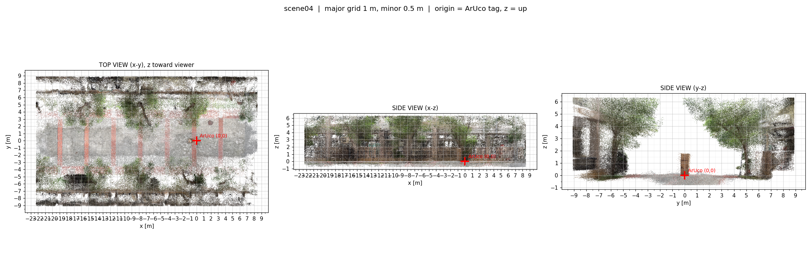

# drone-3dgs-nav

Building a **metric-scale** 3D Gaussian Splatting environment from a hand-held phone video, so a drone visual-navigation policy can be trained in it and then deployed on real hardware.

Two upstream projects are joined here, both from Stanford's Multi-Robot Systems Lab:

| Part | Source | Why |
|---|---|---|
| Scene reconstruction | **FiGS**, from [SousVide](https://github.com/StanfordMSL/SousVide) | The only open pipeline that goes phone video → metric 3DGS, with ArUco for scale |
| Policy training | [**GRaD-Nav++**](https://arxiv.org/abs/2506.14009) | Differentiable RL — no MPC expert, no demonstrations, 3.5 h of training, language-conditioned |

They share scene formats and vehicle configs, but **nobody has connected them before**. That junction is the main engineering work of this project.

Project background, rationale, and known limitations of this approach are in [`CLAUDE.md`](CLAUDE.md). Read that first if you intend to reuse this.

> **Language note.** This README is in English. The chapter-by-chapter implementation notes in [`notes/`](notes/) are in Traditional Chinese — they carry the reasoning behind every deviation from the upstream instructions, so they are worth translating if you get stuck.

---

## Example scene: `scene04`

A tree-lined outdoor plaza, reconstructed from a single 5-minute iPhone 12 video and **verified metric to within 0.87%**.



| | |
|---|---|
| Box stack measured in the point cloud | **172.5 cm** |
| Same stack measured with a tape | **171.0 cm** |
| **Error** | **+0.87%** (threshold: < 2%) |
| Ground plane tilt | 1.14° from vertical |
| Ground flatness, RMS over 30 m | 5.5 mm |

The dense point cloud is checked into this repo — **26 MB, no GPU or setup needed to open it**:

```python
import open3d as o3d
o3d.visualization.draw_geometries([
    o3d.io.read_point_cloud("scenes/scene04/scene04_dense.ply")])
```

The frame is metric and gravity-aligned: origin at the ArUco tag, +z up, ground at z ≈ −0.02 m, distances in metres.

The 1.8 GB trained checkpoint is on the [Releases page](../../releases) — too large for a git repo. Full details, the file layout it needs, and the three things that break loading are in [`scenes/scene04/README.md`](scenes/scene04/README.md).

---

## What is in this repo

| | |
|---|---|
| [`tools/`](tools/) | 14 scripts — calibration, ArUco, frame extraction, mapping, scale verification, export, evaluation, dynamics checks |
| [`notes/`](notes/) | Chapter-by-chapter implementation records (Traditional Chinese), including every deviation from upstream and why |
| [`configs/`](configs/) | Camera intrinsics and capture configs |
| [`scenes/scene04/`](scenes/scene04/) | A complete, scale-verified example scene |
| [`CLAUDE.md`](CLAUDE.md) | Project goals, constraints, expectation management |
| [`implement.md`](implement.md) | The original chapter-by-chapter plan (Traditional Chinese) |

**Not in this repo:** the upstream repos, capture videos, extracted images, SfM intermediates, and training checkpoints — about 49 GB in total. All of it is either downloadable or reproducible. Each section below says how.

---

## 0. Prerequisites

| | Requirement | Check with |
|---|---|---|
| GPU | NVIDIA. **Blackwell (sm_120) recommended** — verified on RTX 5070 Ti and RTX PRO 6000 | `nvidia-smi` |
| CUDA toolkit | **12.8 or newer**, installed system-wide at `/usr/local/cuda` | `nvcc --version` |
| conda | Any distribution | `conda --version` |
| OS | Ubuntu 24.04 | others untested |

### ⚠️ Why the CUDA version matters

SousVide's official `environment_x86.yml` pins `pytorch-cuda=11.8`. **CUDA 11.8 tops out at sm_90 (Hopper) and does not recognise sm_120 (Blackwell) at all.**

Using that file gives you an environment that installs cleanly and then fails at runtime:

```
no kernel image is available for execution on the device
```

So the steps below **do not use the official yml**. Every version is pinned by hand.

---

## 1. Environment setup

Two conda environments. The reason they are separate is in section 1.3.

### 1.1 Main environment `droneenv`

```bash
conda create -n droneenv python=3.10 -y
conda activate droneenv
```

**The order below matters.** Each step explains why.

**Step 1 — PyTorch, cu128 build**

```bash
pip install torch==2.11.0 torchvision==0.26.0 \
  --index-url https://download.pytorch.org/whl/cu128
```

**Step 2 — nerfstudio**

```bash
pip install nerfstudio==1.1.5
```

This downgrades numpy to `1.26.4`. **That is expected — do not undo it.** nerfstudio 1.1.5 is not numpy 2.x compatible, and torch 2.11 is fine with 1.26.4.

**Step 3 — gsplat, built from source, after nerfstudio**

```bash
export TORCH_CUDA_ARCH_LIST="12.0"
export MAX_JOBS=12          # scale to your core count; use 4 on low-RAM machines
export CUDA_HOME=/usr/local/cuda

pip install --no-build-isolation --force-reinstall --no-deps \
  "git+https://github.com/nerfstudio-project/gsplat.git@v1.4.0"
```

Three things to get right:

1. **Order.** gsplat must be installed *after* nerfstudio, or nerfstudio's dependency resolution overwrites your build with the PyPI wheel.
2. **Version 1.4.0, not latest.** nerfstudio 1.1.5 pins `gsplat ==1.4.0` exactly.
3. **Why build from source.** The PyPI `gsplat-1.4.0` is a `py3-none-any` JIT-only wheel with no compiled `.so`. It does not fail immediately — it compiles on the first render call using the local nvcc. That means a stall in the middle of training, and a lost run if compilation fails. Building ahead of time removes that risk entirely.

**Step 4 — swap OpenCV**

```bash
pip uninstall -y opencv-python-headless
pip install opencv-contrib-python==4.10.0.84
```

nerfstudio pins `opencv-python-headless==4.10.0.84`, which **has no ArUco module** — and ArUco is the only thing in this pipeline that knows how long a metre is. `opencv-contrib-python` is the same version with a superset of features.

pip will leave an unsatisfied-requirement warning afterwards. **That is expected.**

**Step 5 — remaining dependencies**

```bash
pip install open3d==0.19.0 gym==0.26.2
```

### 1.2 Isolate a leaked ROS 2 PYTHONPATH

If the machine sets `PYTHONPATH=/opt/ros/jazzy/lib/python3.12/site-packages` globally, it lands **first** on `sys.path`. That is a python 3.12 package directory and `droneenv` is 3.10 — incompatible ABI, and any name collision shadows the real package.

Clear it inside this environment only:

```bash
mkdir -p $CONDA_PREFIX/etc/conda/activate.d $CONDA_PREFIX/etc/conda/deactivate.d

cat > $CONDA_PREFIX/etc/conda/activate.d/zz_isolate_ros.sh << 'EOF'
export _DRONEENV_SAVED_PYTHONPATH="${PYTHONPATH:-}"
unset PYTHONPATH
EOF

cat > $CONDA_PREFIX/etc/conda/deactivate.d/zz_isolate_ros.sh << 'EOF'
export PYTHONPATH="${_DRONEENV_SAVED_PYTHONPATH:-}"
unset _DRONEENV_SAVED_PYTHONPATH
EOF
```

Scripts in `activate.d` run on `conda activate`; `deactivate.d` restores on exit. **The global ROS 2 install is untouched.**

### 1.3 Helper environment `sfmtools` (COLMAP + ffmpeg)

```bash
conda create -n sfmtools -y
conda activate sfmtools
conda install -c conda-forge "colmap=4.0.*" "libfaiss=1.10.*" ffmpeg -y

# pin, so a later conda operation cannot upgrade them and break things
printf 'libfaiss 1.10.*\ncolmap 4.0.*\n' > $CONDA_PREFIX/conda-meta/pinned
```

**Why a separate environment.** Installing colmap into `droneenv` pulls in qt-main 5.15, pango, nss and a full xorg stack. That Qt conflicts with Open3D's visualisation.

**Why libfaiss must be pinned.** The conda-forge colmap package **does not declare its faiss dependency**. Run it as-is and it dies with:

```
undefined symbol: faiss::IndexIVFFlat::IndexIVFFlat(Index*, ulong, ulong, MetricType)
```

faiss 1.12+ changed that constructor signature. Pinning to 1.10 avoids it.

**Expose colmap and ffmpeg to droneenv:**

```bash
conda activate droneenv

cat > $CONDA_PREFIX/etc/conda/activate.d/zz_sfmtools_path.sh << 'EOF'
export _DRONEENV_SAVED_PATH="$PATH"
export PATH="$PATH:$(conda info --base)/envs/sfmtools/bin"
EOF

cat > $CONDA_PREFIX/etc/conda/deactivate.d/zz_sfmtools_path.sh << 'EOF'
export PATH="${_DRONEENV_SAVED_PATH:-$PATH}"
unset _DRONEENV_SAVED_PATH
EOF
```

**Appending rather than prepending is deliberate.** droneenv's own python must win; it must not be shadowed by sfmtools' python. conda-forge binaries resolve their own dependencies through `RPATH $ORIGIN/../lib`, so that Qt stack never leaks in.

**Why these two executables are mandatory:** nerfstudio's `ColmapConverterToNerfstudioDataset.__post_init__` calls `check_ffmpeg_installed()` and `check_colmap_installed()` unconditionally and `sys.exit(1)`s on failure — even with `sfm_tool="hloc"`, which uses pycolmap internally and needs neither executable.

---

## 2. Upstream repositories

```bash
cd <repo root>
mkdir -p repos && cd repos

git clone --recursive https://github.com/StanfordMSL/SousVide.git
git clone https://github.com/Qianzhong-Chen/grad_nav.git
```

`--recursive` is required — FiGS is a submodule of SousVide.

### ⚠️ acados is not needed

SousVide's install instructions tell you to build acados. **Skip it.** acados is only the MPC solver used to synthesise imitation-learning data, and this project takes the GRaD-Nav++ differentiable-RL route instead. That removes the most painful part of the whole install.

### Put the capture configs where the tools expect them

`tools/build_gsplat.py` reads configs from `repos/SousVide/configs/`:

```bash
cd <repo root>
mkdir -p repos/SousVide/configs/captures repos/SousVide/configs/camera
cp configs/captures/*.json repos/SousVide/configs/captures/
cp configs/camera/*.json   repos/SousVide/configs/camera/
```

---

## 3. Verify the environment

**Failures in this pipeline are usually silent** — nothing errors, the result is just worse. Verify at every step.

```bash
conda activate droneenv
python - << 'EOF'
import torch, gsplat, cv2, open3d, numpy
print("torch     :", torch.__version__)
print("cuda ok   :", torch.cuda.is_available())
print("capability:", torch.cuda.get_device_capability())   # (12, 0) on Blackwell
print("arch list :", torch.cuda.get_arch_list())           # must contain 'sm_120'
print("gsplat    :", gsplat.__version__)                   # must be 1.4.0
print("cv2       :", cv2.__version__, "| aruco:", hasattr(cv2, "aruco"))
print("open3d    :", open3d.__version__)
print("numpy     :", numpy.__version__)                    # must be 1.26.x
EOF
```

**`import gsplat` alone is not enough.** This project uses differentiable RL, so gradients have to flow back through the rasteriser — exercise both directions, and confirm the compiled `.so` really contains sm_120 machine code rather than waiting to JIT:

```bash
python - << 'EOF'
import glob, os, gsplat
print("compiled .so:", glob.glob(os.path.join(os.path.dirname(gsplat.__file__), "*.so")))
EOF
cuobjdump --list-elf $(python -c "import glob,os,gsplat;print(glob.glob(os.path.join(os.path.dirname(gsplat.__file__),'*.so'))[0])") | head
```

Then confirm the nerfstudio executables and the two helper binaries resolve:

```bash
for c in ns-train ns-viewer ns-export ns-process-data; do
  command -v $c >/dev/null && echo "$c ok" || echo "$c MISSING"
done
colmap -h 2>&1 | head -1
ffmpeg -version | head -1
```

---

## 4. Building a scene

### 4.1 Camera calibration (once per phone)

Record a video of a printed checkerboard from many angles and distances.

```bash
python tools/make_checkerboard.py                 # printable PDF
python tools/calibrate_camera.py --video captures/<video>.MOV --name <phone>
```

Output lands in `configs/camera/<phone>.json`.

**Reprojection error must be under 0.5 px — but see section 6.1 before trusting the focal length.** A low reprojection error does not mean an accurate `fx`, and `fx` is what sets your scene's scale.

### 4.2 ArUco tag and capture config

The ArUco tag is a printed black-and-white square placed in the scene. **It is the only thing in the entire pipeline that knows how long a metre is.**

```bash
python tools/make_aruco.py --page 210 297        # A4; use 297 420 for A3

python tools/make_capture_config.py \
  --name <config-name> \
  --marker-length 0.144 \
  --num-images 600
```

⚠️ **`--marker-length` must be the measured side of the printed black square, in metres — not the design value.** Printer scaling shifts this by a few percent, and that error passes straight through to your scene scale.

### 4.3 Capture

Hand-hold the phone and walk the scene:

- The ArUco tag must be clearly visible in **at least `num_marked` frames** (default 20)
- **Walk a loop, and vary your height** — crouch, stand, reach up. A straight-line path produces a degenerate reconstruction that passes every SfM check and still fails on scale (see `notes/07-scene-experiments.md`)
- Move slowly; motion blur causes SfM registration failures
- Keep the camera pointed at things with texture, not blank walls

Put the video here, with the scene name in the filename, matching exactly one file:

```
repos/SousVide/gsplats/capture/<something-with-scenename>.MOV
```

Then pre-check it:

```bash
python tools/preflight_capture.py --video <video> --config <config-name>
```

### 4.4 Run the pipeline

```bash
./tools/run_pipeline.sh --scene scene05 --config iphone12_600
```

That runs every stage in order. You can also run a subset:

```bash
./tools/run_pipeline.sh --scene scene05 --config iphone12_600 --stages scale,train,export
```

| Stage | What it does | Time for 600 images |
|---|---|---|
| `frames` | Extract frames by 1-D farthest point sampling | ~6 min |
| `sfm` | hloc SuperPoint + SuperGlue, exhaustive matching | **~2 h 40 min** |
| `check` | Verify registration rate and tag-frame count — **changes nothing** | seconds |
| `scale` | Solve `Sim(3)` from ArUco, write metric `transforms.json` | ~40 s |
| `train` | `ns-train splatfacto`, 30k steps | ~20 min |
| `export` | Back-project a dense point cloud | ~27 min |
| `verify` | Automatic ground-plane and plane-distance checks | ~1 min |

**`check` is a separate stage on purpose.** If the tag-bearing frames are not all registered, the downstream step throws `Mismatched number of aruco and sfm transforms` — and by then SfM has already burned hours.

**SfM cost is quadratic in image count.** Exhaustive matching compares every pair:

| Images | Pairs | SfM time |
|---|---|---|
| 300 | 44,850 | 30 min (measured) |
| 600 | 179,700 | 2 h 40 min (measured) |
| 1000 | 499,500 | ~5.5 h |
| 5000 | 12,497,500 | ~6 days |

More images is not better past a point. On the same video with the same path, 300 → 400 images changed eval PSNR from 21.12 to 20.86. **Trajectory shape dominates; image count does not.**

### 4.5 Verify the scale — do not skip this

```bash
./tools/open_pointcloud.sh scene05
```

Shift + left-click two points, press Q, and the distance is printed. **Measure something you can physically reach with a tape. The error must be under 2%.**

Getting scale wrong does not raise an error. It silently corrupts the dynamics, the 0.5 m obstacle threshold, and the reward.

### 4.6 Prepare the cloud for training

```bash
python tools/prepare_pointcloud.py     # outlier removal, voxel downsample, validation
python tools/verify_dynamics.py        # quadrotor parameter sanity checks
python tools/fly_orbit_preview.py      # fly a real simulated orbit, render the view
```

Downsampling is not optional: grad_nav's `ObstacleDistanceCalculator` builds four `[num_envs, num_points, 3]` tensors at once. At 128 environments, scene04's 978k points would need about 4 GB on top of the Gaussians. Under 100k points keeps it near 0.4 GB.

---

## 5. Viewing a scene

```bash
./tools/open_pointcloud.sh scene04     # Open3D window, dense cloud, click to measure
./tools/open_gsplat.sh     scene04     # nerfstudio web viewer at localhost:7007
```

`open_gsplat.sh` picks the most recent training run automatically. **Stop it with Ctrl+C** — closing the browser tab leaves it holding about 2.7 GB of GPU memory.

## Moving a trained scene to another machine

Tested by copying only the files below into an empty directory and loading them with the same `eval_setup(config, test_mode="inference")` call grad_nav uses.

**Four files. The 620 MB of source images are not among them.**

```
workspace/                                   ← working directory
├── <scene>/
│   └── transforms.json                      520 KB
└── outputs/<scene>/splatfacto/<timestamp>/
    ├── config.yml                           8 KB
    ├── dataparser_transforms.json           310 B
    └── nerfstudio_models/step-*.ckpt        1.8 GB
```

`sparse_pc.ply` is optional — without it you get an Open3D warning and loading still succeeds. It is small, so bring it anyway.

```bash
rsync -avP other-host:.../<scene>/transforms.json                        <scene>/
rsync -avP other-host:.../outputs/<scene>/splatfacto/<timestamp>/  outputs/<scene>/splatfacto/<timestamp>/
```

**Three things break this:**

1. **Do not rename the timestamp directory.** The checkpoint path is rebuilt from the `timestamp` field inside `config.yml`, not resolved relative to the file's own location.
2. **Working directory must be the common parent** of `<scene>/` and `outputs/`, because `config.yml` stores relative paths.
3. **gsplat must be 1.4.0 on both machines.** The checkpoint holds raw parameter tensors.

If you only want to look at the scene, copy the dense `.ply` (26 MB) instead — no checkpoint, no nerfstudio.

---

## 6. Pitfalls

### 6.1 ⚠️ The two places intrinsics enter — and why they must agree

**This is the failure that cost a full rebuild of scene04.** It produced a 3.37% scale error and no warning of any kind.

Camera intrinsics are consumed at three points in this pipeline:

| Step | Source of intrinsics |
|---|---|
| SfM (`stage_sfm`) | COLMAP's own self-calibration — `build_gsplat.py` never passes `cfg["camera"]` to it |
| ArUco solve (`stage_scale`) | `cfg["camera"]`, i.e. your checkerboard calibration |
| 3DGS training (`stage_train`) | `transforms.json`, i.e. COLMAP's values again |

Two of three used COLMAP's values; only the scale step used the checkerboard's. Since `solvePnP` returns a distance **proportional to fx**, a focal length 2.32% too large yields a scene 2.32% too large.

| | Checkerboard fx = 1702.28 | COLMAP fx = 1663.73 |
|---|---|---|
| ArUco scale consistency | 3.5% | **2.6%** |
| RANSAC inliers | 9 / 20 | **11 / 20** |
| Median residual | 0.080 m | **0.044 m** |
| **Scale error vs tape** | **+3.37% — failed** | **+0.87% — passed** |

Every independent metric improved together — this was not a fit to the one measurement.

**The check to run before trusting a scene:**

```bash
python - << 'EOF'
import json
sfm = json.load(open("repos/SousVide/gsplats/workspace/<scene>/sfm/transforms.json"))
cfg = json.load(open("repos/SousVide/configs/captures/<config>.json"))["camera"]
fx_cfg = cfg["intrinsics_matrix"][0][0]
d = fx_cfg / sfm["fl_x"] - 1
print(f"config fx {fx_cfg:.2f} vs SfM fl_x {sfm['fl_x']:.2f}  ->  {d*100:+.2f}%")
print("OK" if abs(d) < 0.01 else "MISMATCH — this becomes your scale error")
EOF
```

When they disagree, **prefer COLMAP's**. It is self-calibrated from hundreds of images across the whole scene; a checkerboard video with poor corner coverage is far more weakly constrained, and its low reprojection error will not reveal the problem.

### 6.2 Silent failures to watch for

- **`orientation-method`, `center-method`, `auto-scale-poses`.** Defaults are `up`, `poses`, `True` — **all three destroy metric scale.** They belong to the `nerfstudio-data` dataparser and must appear *after* it on the command line. `build_gsplat.py` already sets them to `none`, `none`, `False`.
- **Every SfM metric can be green while scale is wrong.** scene02 registered 100% of images at 1.398 px and still had 106.7% ArUco scale dispersion, because the camera walked a straight line. Only an external metric reference catches this.
- **Laplacian variance is not a blur metric.** It responds to image content too. In scene02 the lowest-scoring frames were perfectly sharp photographs of a blank wall. Only compare within one scene.

### 6.3 grad_nav hardcoded values

grad_nav has several values baked in for the authors' own drone (`carl`). **These must be changed:**

| File | Hardcoded | Change to |
|---|---|---|
| `utils/gs_local.py` | `fx=462.956, fy=463.002, cx=323.076, cy=181.184` at 640×360 | These are RealSense D435 values — use your own onboard camera's |
| `utils/gs_local.py` | three constant matrices in `pose2nerf_transform()` | `T_r2d` is the camera's **mounting extrinsics** (theirs: 15.2 cm forward, 8° down) |
| `utils/gs_local.py` **and** `envs/*.py` | a `maps` dict in each | **Add your scene to both** |
| `envs/drone_long_traj.py` | `gs_origin_offset = [-6.0, 0, 0]` | Match your scene's origin |
| `envs/drone_vla_*.py` | `task_table` | Instruction strings and their waypoints |

Record what you change and why.

### 6.4 Inherent limits of this approach

Not implementation defects — properties of the method:

- **Policies are per-scene.** Zero-shot transfer covers the render-vs-real gap only, not new rooms. A new space means new footage and new training.
- **Fragile to static scene changes.** SousVide measured a drop from 96% to 25% success when objects present during training were removed; the policy keeps flying through where they used to be. People walking around barely matter.
- **No collision termination in simulation.** Obstacle avoidance is a soft reward inside 0.5 m. Real hardware does collide — the paper reports 6–7 of 10.
- **Language instructions are not open-vocabulary.** GRaD-Nav++ covers 4 directions × 3 targets = 12 combinations.
- **Fails in low light.** Below 40% of original brightness, SousVide's policies drift off course from the start.

---

## Implementation notes

`notes/` holds the record of what was actually done, including every deviation from the upstream instructions and the reasoning. **Written in Traditional Chinese**, and more useful than this README when something breaks.

| File | Topic |
|---|---|
| [`notes/00-prechecks.md`](notes/00-prechecks.md) | Pre-flight checks |
| [`notes/01-environment.md`](notes/01-environment.md) | Environment install, all deviations and why |
| [`notes/02-code-and-example.md`](notes/02-code-and-example.md) | Running the upstream example first |
| [`notes/03-calibration.md`](notes/03-calibration.md) | Camera calibration — including why the upstream tool is broken |
| [`notes/04-aruco.md`](notes/04-aruco.md) | ArUco and metric scale |
| [`notes/05-06-capture-and-gsplat.md`](notes/05-06-capture-and-gsplat.md) | Capture and mapping |
| [`notes/07-scene-experiments.md`](notes/07-scene-experiments.md) | Three-scene comparison — why trajectory shape beats image count |

## References

| Paper | Role |
|---|---|
| [SousVide](https://arxiv.org/abs/2412.16346) (arXiv 2412.16346) | Source of the mapping method; section III-A is FiGS |
| [GRaD-Nav++](https://arxiv.org/abs/2506.14009) (RA-L) | The training method |
| [GRaD-Nav](https://arxiv.org/abs/2503.03984) | Predecessor — differentiable RL and CENet; read before GRaD-Nav++ |

## License

The tools and notes in this repository are the author's own work. The upstream projects carry their own licenses — see [SousVide](https://github.com/StanfordMSL/SousVide) and [grad_nav](https://github.com/Qianzhong-Chen/grad_nav).
