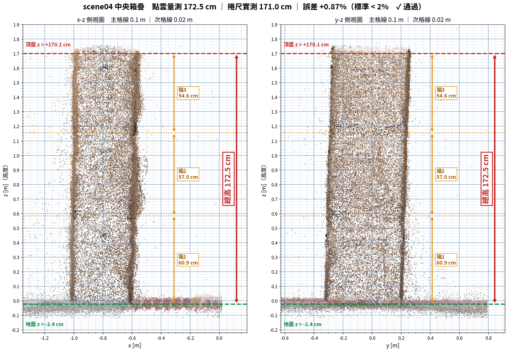

# scene04 — outdoor plaza, metric-scale 3DGS

A metric-scale 3D Gaussian Splatting reconstruction of a tree-lined outdoor plaza, built from a single hand-held iPhone 12 video. Scale is anchored by a printed ArUco tag and **verified against a physical tape measurement**.


## Verified metric accuracy

The scene contains a stack of three cardboard boxes near the origin. It was measured both ways:

| | |
|---|---|
| Height measured in the point cloud | **172.5 cm** |
| Height measured with a tape | **171.0 cm** |
| **Error** | **+0.87%** |
| Acceptance threshold | < 2% — **passed** |



Supporting checks, none of which depend on the tape measurement:

| Check | Value |
|---|---|
| Ground plane tilt from the z axis | **1.14°** |
| Ground plane height (ArUco tag was on the ground, so ideally 0) | **−2.24 cm** |
| Ground flatness, RMS over the whole 30 m plaza | **5.5 mm** |
| ArUco scale consistency (IQR / median over 20 observations) | **2.6%** |
| Camera height range over the walk (hand-held, so ~1.0–1.8 m expected) | **0.9 – 2.3 m** |

## What is in this directory

| File | Size | What it is |
|---|---|---|
| `scene04_dense.ply` | 26 MB | **Dense colored point cloud, 978,285 points.** Open this first — it needs no GPU and no environment |
| `transforms.json` | 519 KB | Camera poses for all 600 images, in metres, plus the camera intrinsics |
| `sparse_pc.ply` | 3.7 MB | Sparse SfM point cloud, 141,364 points |
| `splatfacto/2026-08-30_221930/config.yml` | 7.5 KB | nerfstudio training config |
| `splatfacto/2026-08-30_221930/dataparser_transforms.json` | 310 B | Dataparser state, needed to load the checkpoint |
| `figures/` | 3.7 MB | Verification figures |

**The trained checkpoint is not in this repository.** It is 1.8 GB, over GitHub's 100 MB per-file limit. Download it from the [Releases page](../../releases) — see below.

The 600 source images (2.3 GB), the SfM intermediates (4.7 GB), and the original video (566 MB) are not published. They can be regenerated from the video with the pipeline in the top-level README.

## Opening the scene

### Option A — just look at it (no GPU, no setup)

Open `scene04_dense.ply` in any point cloud viewer: CloudCompare, MeshLab, Blender, or Open3D.

```python
import open3d as o3d
pcd = o3d.io.read_point_cloud("scene04_dense.ply")
o3d.visualization.draw_geometries([pcd])
```

The coordinate frame is metric and gravity-aligned:

- **Origin** is the ArUco tag, lying flat on the ground
- **+z is up**, and the ground plane sits at z ≈ −0.02 m
- Distances are in **metres**

So you can measure anything directly. The box stack is at roughly `x = −0.73, y = −0.01`, rising to `z = 1.70`.

### Option B — render the full 3DGS

This needs the environment from the top-level README, plus the checkpoint from Releases.

**1. Download the checkpoint**

```bash
gh release download scene04-v1 --pattern "*.ckpt" --dir .
```

**2. Lay the files out like this.** The directory names matter — see the warning below.

```
workspace/                                   ← run commands from HERE
├── scene04/
│   └── transforms.json
└── outputs/scene04/splatfacto/2026-08-30_221930/
    ├── config.yml
    ├── dataparser_transforms.json
    └── nerfstudio_models/
        └── step-000029999.ckpt
```

```bash
mkdir -p workspace/scene04
mkdir -p workspace/outputs/scene04/splatfacto/2026-08-30_221930/nerfstudio_models
cp transforms.json                                     workspace/scene04/
cp splatfacto/2026-08-30_221930/config.yml             workspace/outputs/scene04/splatfacto/2026-08-30_221930/
cp splatfacto/2026-08-30_221930/dataparser_transforms.json workspace/outputs/scene04/splatfacto/2026-08-30_221930/
cp step-000029999.ckpt                                 workspace/outputs/scene04/splatfacto/2026-08-30_221930/nerfstudio_models/
```

**3. Launch the viewer**

```bash
conda activate droneenv
cd workspace
ns-viewer --load-config outputs/scene04/splatfacto/2026-08-30_221930/config.yml
```

Then open <http://localhost:7007>.

### ⚠️ Three things that will break loading

**1. Do not rename the timestamp directory.** The checkpoint path is rebuilt from the `timestamp` field inside `config.yml`, not resolved relative to where `config.yml` actually sits. Renaming `2026-08-30_221930` to anything else gives you:

```
No checkpoint directory found at outputs/scene04/splatfacto/2026-08-30_221930/nerfstudio_models
```

**2. Run from the right working directory.** `config.yml` stores relative paths (`data: scene04`, `output_dir: outputs`), so your working directory must be the common parent of `scene04/` and `outputs/`.

**3. gsplat must be version 1.4.0** on both machines. The checkpoint stores raw Gaussian parameter tensors; a different gsplat version will not line up.

The 600 source images are **not** needed to load the scene — this was tested directly. nerfstudio reads camera poses from `transforms.json` and never opens the image files.

## How the scene was built

| Stage | Detail |
|---|---|
| Capture | iPhone 12, 1x wide lens, hand-held portrait, 1080×1920 at 30 fps, 15.3 Mbps, 304 s, 9129 frames |
| Frame selection | 600 frames by **1-D farthest point sampling** on the frame index, run separately over two pools: 20 frames containing the ArUco tag, 580 without |
| SfM | hloc — SuperPoint (avg 1,909 keypoints per image, 256-D descriptors) + SuperGlue, **exhaustive** matching over 179,699 pairs, 2 h 40 min |
| Metric scale | ArUco `DICT_4X4_50` id 0, printed square measured at **14.4 cm**, `Sim(3)` fitted by RANSAC over 20 tag observations |
| Training | nerfstudio `splatfacto`, 30,000 steps, 20 min on an RTX 5070 Ti |
| Dense export | 1 M points back-projected from 540 training cameras, statistical outlier removal → 978,285 points |

### SfM results

| Metric | Value |
|---|---|
| Registered images | **600 / 600 (100%)** |
| Images filtered out | 0 |
| Camera models | 1 |
| 3D points | 141,364 |
| Observations | 996,064 |
| Mean track length | 7.05 |
| **Mean reprojection error** | **1.360 px** |

### Camera intrinsics

| | fx | fy | cx | cy |
|---|---|---|---|---|
| **Used** (COLMAP self-calibration) | 1663.7297 | 1663.3227 | 540.0 | 960.0 |
| Rejected (checkerboard calibration) | 1702.2846 | 1708.6379 | 544.8 | 949.1 |

Distortion (OPENCV model): `k1=0.10244, k2=-0.14369, p1=0.00023, p2=-0.00051`

### ⚠️ Why the checkerboard calibration was rejected

This is the single most important lesson from building this scene, and it cost a full rebuild.

The pipeline uses camera intrinsics in **two independent places**:

| Step | Source of intrinsics |
|---|---|
| SfM reconstruction (COLMAP) | COLMAP's own self-calibration |
| ArUco `solvePnP` in the scale step | whatever is in the capture config |
| 3DGS training | `transforms.json`, i.e. COLMAP's values |

Two of the three used COLMAP's values; only the scale step used the checkerboard calibration. Since `solvePnP` returns a distance **proportional to fx**, a focal length 2.32% too large produced a scene 2.32% too large — and nothing in the pipeline warned about it.

| | Checkerboard fx = 1702.28 | COLMAP fx = 1663.73 |
|---|---|---|
| Sim(3) scale `cs` | 2.921600 | **2.845961** |
| ArUco scale consistency | 3.5% | **2.6%** |
| RANSAC inliers | 9 / 20 | **11 / 20** |
| Median residual | 0.080 m | **0.044 m** |
| **Box stack height** | 176.76 cm | **172.50 cm** |
| **Error vs 171.0 cm tape** | **+3.37% — failed** | **+0.87% — passed** |

Every independent quality metric improved together, not just the one being fitted. The checkerboard calibration had passed its reprojection-error check at 0.078 px, but its corner coverage reached only 1.9% in the sparsest image region against a 3% threshold — low reprojection error does not mean an accurate focal length.

**If you reuse this pipeline: make sure the intrinsics fed to the ArUco solve match the ones the SfM actually used.**

## Known limitations

- **Reconstruction quality falls off at depth discontinuities** — tree canopy against sky produces a halo of floating points. Filter these before using the cloud for obstacle distances.
- **The ground has about 6 cm of point spread** in z, typical for 3DGS on flat low-texture asphalt. The mean is accurate (5.5 mm plane RMS), but single-point distance queries will jitter by a few cm. Use plane or region statistics instead.
- **The video was shot in portrait.** An onboard drone camera is landscape, so there is a field-of-view mismatch to handle before using this scene for policy training.
- **The individual box heights (60.9 / 57.0 / 54.6 cm) are approximate.** They come from brightness dips at the seams, which are several cm wide. Only the 172.5 cm total is a plane-fit measurement.
