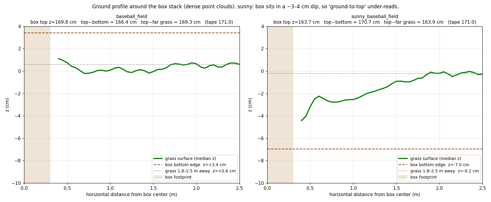
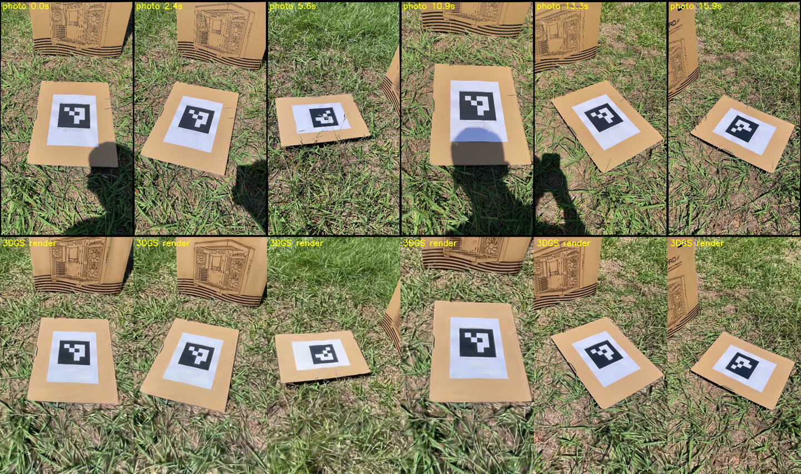

# sunny_baseball_field — grass baseball field on a sunny day, metric-scale 3DGS

A metric-scale 3D Gaussian Splatting reconstruction built from a single hand-held iPhone 12 video (`IMG_2527.MOV`, not published). It shows the same field and the same stack of cardboard boxes as `baseball_field`, an overcast capture made 12 days earlier (not published in this repository), re-shot in sunshine.

**The first 16 s of the video show the camera operator's own shadow. None of those frames were used for training.** No shadow is visible in the scene; this was confirmed by rendering the scene at the original poses of those frames (see "Shadow check" below).


## Verified metric accuracy

### Main evidence: close-range tag cross-check

Only 4 close-range tag observations (107–178 px) in the training set could be used for the scale solve, because almost all close-up shots of the tag fall inside the excluded first 16 s. For an independent check, 92 close-range frames from those 16 s **in which the shadow does not cover the tag** (tag 175–319 px, camera 0.71–1.19 m from the tag) were **localized** into the existing SfM model with hloc — only their camera poses were computed; **they were not added to the SfM or to 3DGS training** — and the scale was re-solved with the same solvePnP + Sim(3):

| | Scale `cs` |
|---|---|
| Used by the scene (4 tags in the training set) | **1.755739** |
| 92 close-range observations (independent) | **1.744361** (the scene is 0.65% larger) |
| — first half / second half only | 1.772288 / 1.741610 |
| — random half, 10 draws | 1.749311 – 1.764614 |

The value in use lies within the spread of the independent estimates and differs by **0.65%**, below the 2% threshold.

Localization quality: 92 of 92 frames localized, with a median of 472 inliers each. Rendering the 3DGS at these 92 poses, the tag corners in the render and in the photo differ by a **median of 1.8 px** (90% within 2.7 px).

### Box height (tape measure: 171.0 cm)

| Method | Box height | Error |
|---|---|---|
| From the box's own bottom edge to its top (0.25 m wide column) | **170.7 cm** | **−0.19%** |
| From the surrounding ground plane to the top (median of 54 parameter combinations, tag board excluded) | 167.2 cm | −2.20% |

The two methods differ by 3.5 cm because **this time the box stands in a shallow dip**:



The grass next to the box is about 3–4 cm lower than the grass 2 m away, and the box's bottom edge is at z = −7.0 cm. Measuring "from the surrounding ground" counts that dip as the box being shorter. In `baseball_field` the ground around the box was flat (±0.6 cm), so the ground-based method was accurate there (same method: 171.4 cm, +0.21%).

⚠ The box-height method was switched after seeing the result, which invites the suspicion of picking whichever method looks best. So **the scale passes mainly on the tag cross-check above**; the box height is supporting evidence only.

### Checks that do not depend on the tape measure

| Check | Sparse cloud | Dense cloud |
|---|---|---|
| Ground plane tilt from the z axis | 1.62° | **0.85°** |
| Ground height at the origin (the tag lies on a board, slightly above the grass) | −1.92 cm | −2.25 cm |
| Ground flatness, RMS | 5.8 mm | 5.7 mm |
| Sim(3) fit, median residual | **0.17 cm** | |

### Shadow check



Top row: original photos from the first 16 s (the camera operator's shadow is visible at 0.0, 2.4, 10.9 and 13.3 s). Bottom row: the 3DGS rendered at the same poses — **no shadow**. None of these photos were used for training.

## What is in this directory

| File | Size | What it is |
|---|---|---|
| `sunny_baseball_field_dense.ply` | 25 MB | **Dense colored point cloud, 960,747 points.** Open this first — it needs no GPU and no environment |
| `transforms.json` | 520 KB | Camera poses for all 600 images (metres, levelled) plus the camera intrinsics |
| `sparse_pc.ply` | 2.0 MB | Sparse SfM point cloud, 78,534 points |
| `splatfacto/2026-09-21_190438/config.yml` | 7.5 KB | nerfstudio training config |
| `splatfacto/2026-09-21_190438/dataparser_transforms.json` | 310 B | Dataparser state, needed to load the checkpoint |
| `figures/` | 1.9 MB | Verification figures |

**The trained checkpoint is not in this repository.** It is 1.38 GB, over GitHub's 100 MB per-file limit. Download it from the [`sunny_baseball_field-v1` release](https://github.com/JeremyHo1123/drone-3dgs-nav/releases/tag/sunny_baseball_field-v1) — see below.

The 600 source images, the SfM intermediates and the original video (662 MB) are not published. Neither are the 92 query images from the first 16 s or the cross-check analysis scripts.

## Opening the scene

### Option A — just look at it (no GPU, no setup)

Open `sunny_baseball_field_dense.ply` in any point cloud viewer: CloudCompare, MeshLab, Blender, or Open3D.

```python
import open3d as o3d
o3d.visualization.draw_geometries([
    o3d.io.read_point_cloud("scenes/sunny_baseball_field/sunny_baseball_field_dense.ply")])
```

The coordinate frame is metric and gravity-aligned:

- **Origin** is the center of the ArUco tag
- **+z is up**, levelled to the field's ground within 12 m (see "Leveling" below); the tag itself is tilted by about 3°
- Distances are in **metres**

The box stack is at about `x = −0.08, y = +0.58`, with its top at z ≈ 1.64 (its bottom sits in the dip, at z ≈ −0.07).

### Option B — render the full 3DGS

This needs the environment from the top-level README, plus the checkpoint from the release.

**1. Download the checkpoint**

```bash
gh release download sunny_baseball_field-v1 -R JeremyHo1123/drone-3dgs-nav --pattern "*.ckpt" --dir .
```

Without the GitHub CLI, download it in a browser: <https://github.com/JeremyHo1123/drone-3dgs-nav/releases/download/sunny_baseball_field-v1/step-000029999.ckpt>

**2. Lay the files out like this.** The directory names matter — see the warning below.

```
workspace/                                   ← run commands from HERE
├── sunny_baseball_field/
│   └── transforms.json
└── outputs/sunny_baseball_field/splatfacto/2026-09-21_190438/
    ├── config.yml
    ├── dataparser_transforms.json
    └── nerfstudio_models/
        └── step-000029999.ckpt
```

Run these from `scenes/sunny_baseball_field/`, with the downloaded checkpoint in the same directory:

```bash
mkdir -p workspace/sunny_baseball_field
mkdir -p workspace/outputs/sunny_baseball_field/splatfacto/2026-09-21_190438/nerfstudio_models
cp transforms.json                                          workspace/sunny_baseball_field/
cp splatfacto/2026-09-21_190438/config.yml                  workspace/outputs/sunny_baseball_field/splatfacto/2026-09-21_190438/
cp splatfacto/2026-09-21_190438/dataparser_transforms.json  workspace/outputs/sunny_baseball_field/splatfacto/2026-09-21_190438/
cp step-000029999.ckpt                                      workspace/outputs/sunny_baseball_field/splatfacto/2026-09-21_190438/nerfstudio_models/
```

**3. Launch the viewer**

```bash
conda activate droneenv
cd workspace
ns-viewer --load-config outputs/sunny_baseball_field/splatfacto/2026-09-21_190438/config.yml
```

Then open <http://localhost:7007>.

⚠ The same three things break loading as for scene04 (details in [`scenes/scene04/README.md`](../scene04/README.md)):

1. **Do not rename the timestamp directory** `2026-09-21_190438`. The checkpoint path is rebuilt from the `timestamp` field inside `config.yml`.
2. **Run from `workspace/`.** `config.yml` stores relative paths.
3. **gsplat must be version 1.4.0.**

## How the scene was built

| Stage | Detail |
|---|---|
| Capture | iPhone 12, 1x wide lens, hand-held portrait, 1080×1920 at 29.97 fps, 15.6 Mbps, 340.0 s, 10,193 frames |
| Skipped start | **The first 16 s (frames 0–479) never enter the sampling pools**: `"skip_start_sec": 16` in the capture config's `extractor` block |
| Frame selection | 600 frames. The remaining frames go through the usual **1-D farthest point sampling**, separately for frames with and without the tag (20 + 580) |
| SfM | hloc — SuperPoint + SuperGlue, **exhaustive** matching over 179,700 pairs, about 2 h |
| Metric scale | ArUco `DICT_4X4_50` id 0, side **14.4 cm**, `Sim(3)` RANSAC, **`--tag-rule present`**, close-range tags only (default `--min-tag-px 100`) |
| Leveling | **`--level-ground 12`**: the ground within 12 m made horizontal, a 2.98° rotation |
| Training | nerfstudio `splatfacto`, 30,000 steps, 17 min on an RTX 5070 Ti, 1,931,995 Gaussians |
| Dense export | 1 M points back-projected from 540 training cameras, statistical outlier removal → 960,747 points |

The commands used (the video goes in `repos/SousVide/gsplats/capture/sunny_baseball_field_IMG_2527.MOV`):

```bash
./tools/run_pipeline.sh --scene sunny_baseball_field --config iphone12_600_sunny --stages frames,sfm,check
python tools/use_sfm_intrinsics.py --scene sunny_baseball_field --config iphone12_600_sunny
./tools/run_pipeline.sh --scene sunny_baseball_field --config iphone12_600_sunny \
    --stages scale,train,export,verify --tag-rule present --level-ground 12
```

At the time, the middle step (copying the SfM intrinsics into the config) was done by hand. `tools/use_sfm_intrinsics.py` now does the same thing, and was checked to produce exactly the camera block in `configs/captures/iphone12_600_sunny.json`.

### SfM results

| Metric | Value |
|---|---|
| Registered images | **600 / 600 (100%)** |
| Camera models | 1 |
| 3D points | 78,534 |
| Observations | 602,623 |
| Mean track length | 7.67 |
| **Mean reprojection error** | **1.438 px** |

The final bundle adjustment reported `No convergence`, but its cost only changed from 0.894964 px to 0.894427 px. It was already at the optimum, so this does not affect the result.

### Camera intrinsics

From **COLMAP self-calibration on this video itself**. Same phone as `baseball_field` (fx differs by 0.13%).

| fx | fy | cx | cy |
|---|---|---|---|
| 1666.5735 | 1667.9732 | 540.0 | 960.0 |

Distortion (OPENCV model): `k1=0.10385, k2=-0.15085, p1=-0.000119, p2=-0.0000753`

Config: `configs/captures/iphone12_600_sunny.json`

For comparison, the checkerboard calibration of the same phone (`configs/camera/iphone12_600.json`, fx = 1702.28) is 2.14% larger. Using it for the scale solve would have made the whole scene about 2% too large — the same failure as scene04's first build (top-level README, section 6.1).

### Three pipeline changes made for this scene

Each is documented in the docstrings of `tools/build_gsplat.py`.

1. **`skip_start_sec`** (capture-config field): frames in the first N seconds never enter the sampling pools. Sampling of the remaining frames is unchanged.
2. **`--tag-rule present`**: grass texture is often misdetected as small fake tags (ids 17, 23, 37, ...). The upstream rule, "exactly one tag in the image", throws the whole image away. Here that discarded **17** of the 37 images containing the real tag — including the ones where the tag is largest (129, 108 and 95 px). With "use the image if id 0 is present", the median residual went from 0.89 cm to **0.17 cm**.
3. **`--level-ground 12`**: the tag lay on the grass tilted by about 3.5°, and the whole scene tilted with it. Ground fits at every radius (2–15 m) gave a consistent 3.4–4.3° tilt in the same direction, while the same field in `baseball_field` tilts only 0.66° at large radius. After the scale solve, the scene is only rotated (scale and origin unchanged) so that the ground is level.

All three are off by default, so rebuilding older scenes gives the same result. (The close-range tag filter `--min-tag-px`, default 100, is a separate and earlier change; see the top-level README.)

## Known limitations

- **The horizontal reference is an assumption: "the field's ground is level".** The tag, the box and the large-scale ground each point about 3° away from one another (after leveling, the tag tilts 2.98° toward +126° and the box 2.77° toward +95°); nothing on grass is truly horizontal. The ground was chosen because it covers the largest area and the same field measured close to level in `baseball_field`. To be more certain, the true vertical could be taken from vertical edges of distant buildings (not done yet).
- **The ground within 2 m of the box has a 3–4 cm dip.** Height-related quantities taken from the point cloud (e.g. height above ground) are off by a few cm locally near the box.
- **Only 4 close-range tags are in the training set.** The main support for the scale comes from the 92 localized images outside the training set. In the next capture, the close-up tag shots should not overlap with the part where the camera operator is in the frame.
- **Grass is a low-texture surface**, so there are fewer 3D points (78k) than in `baseball_field` (109k).
- **The video was shot in portrait.** An onboard drone camera is landscape, so there is a field-of-view mismatch to handle before using this scene for policy training.
- **PSNR is low, but at the same level as the earlier capture of the same field**: `tools/eval_gsplat.py` measures 15.26 dB (train) / 14.80 dB (eval); the same tool gives 16.82 / 16.77 dB for `baseball_field`. Most likely the fine texture of grass blades lowers per-pixel comparison scores.
